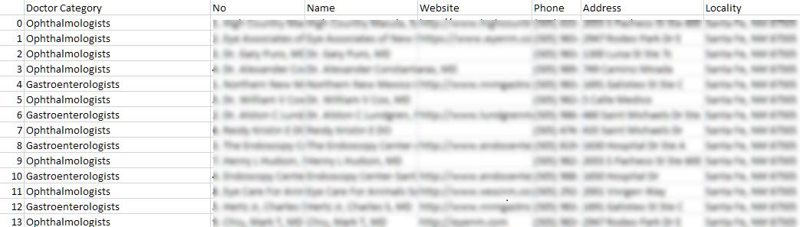

# Identifying-Hospitals-Clinics-and-Chamber-with-Pandas

From 67,000 rows of directory data of Doctors, I identify which are most likely to be single practitioner, chambers, clinics and hospitals with few lines of python+pandas code.

Details in the iPython Notebook.

## Formulas used

* `value_counts`
* `rename_axis`
* `reset_index`
* `isin`

